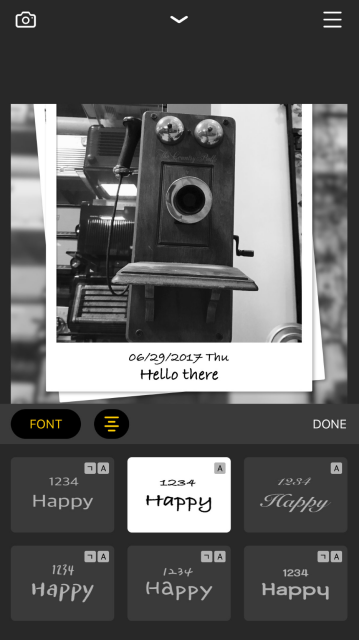

# 경력

#### iOS developer
	
* 2016.09 ~ 현재

#### 부스트 코스 iOS 코드 리뷰어 및 컨텐츠 제작

* 2018.03 ~ 현재

#### 부스트코스 iOS 컨텐츠 제작 어시스턴트

* 2017.10 ~ 2018.02

#### 경희매니지먼트 (강동 경희대학교병원 의료정보팀)

* 2013.04 ~ 2016.04

# 프로젝트
## 개인 및 팀

#### gandanFrame

> 사진 필터 앱

* 기간 : 2017.12 ~ 2018.03 (운영중)
* 소속 : 2인 팀
* 역할 : iOS 개발 및 기획
* 사용기술 : Swift 4, Photos, AVFoundation
* 앱스토어 : [gandanFrame](https://itunes.apple.com/kr/app/gandanframe/id1353640089?mt=8)

#### maplans

> 여행길을 만들어주는 여행 플래너 앱

* 기간 : 2017.06 ~ 2017.11 (운영중)
* 소속 : someinitial LLC.
* 역할 : iOS 개발
* 사용기술 : Swift 3, Mapkit, Realm, Google place
* 앱스토어 : [maplans](https://itunes.apple.com/kr/app/maplans/id1315266637?mt=8)

#### maptales - 여행을 추억하는 새로운 방법

> 사진의 EXIF데이터를 이용해 다녀온 여행의 경로를 자동으로 그려주는 앱

* 기간 : 2016.08 ~ 2017.04 (운영중)
* 소속 : someinitial LLC.
* 역할 : iOS 개발
* 사용기술 : Swift 3, Mapkit, Mapbox, Realm
* 앱스토어 : [maptales - 여행을 추억하는 새로운 방법](https://itunes.apple.com/kr/app/maptales-%EC%97%AC%ED%96%89%EC%9D%84-%EC%B6%94%EC%96%B5%ED%95%98%EB%8A%94-%EC%83%88%EB%A1%9C%EC%9A%B4-%EB%B0%A9%EB%B2%95/id1174694057?mt=8)

## 외주

#### Luminati - Moblie

> 모바일 내시경 앱

* 기간 : 2018.02 ~ 2018.05 (운영중)
* 소속 : Sonority Inc.
* 역할 : iOS 개발
* 사용기술 : Swift 4, Core Bluetooth, AVFoundation
* 앱스토어 : [Luminati - Moblie](https://itunes.apple.com/us/app/luminati-mobile/id1300475290?mt=8)

